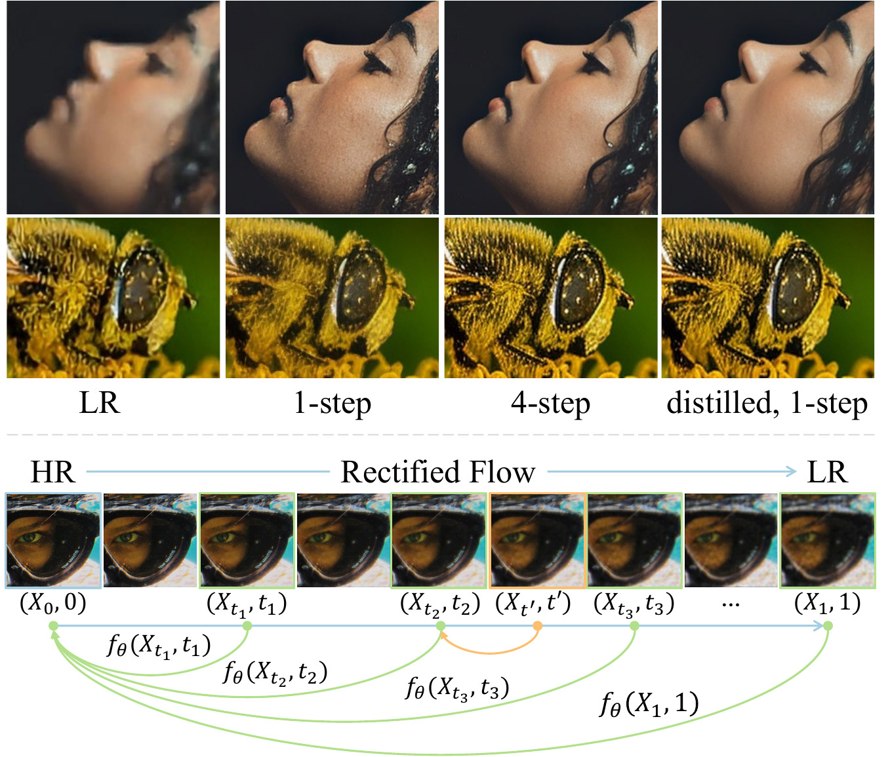
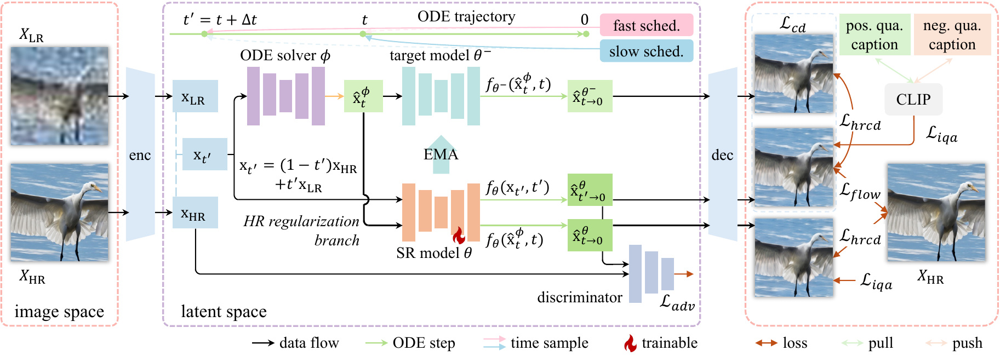
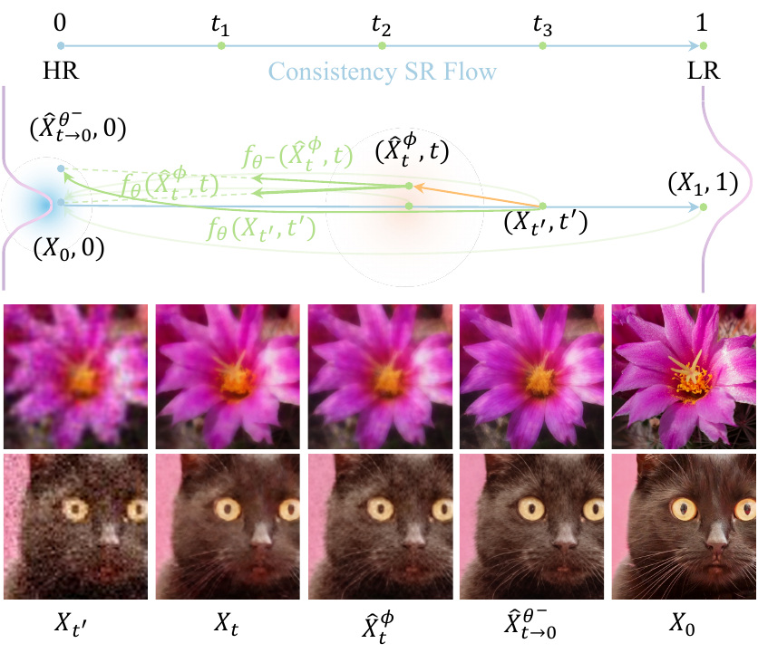
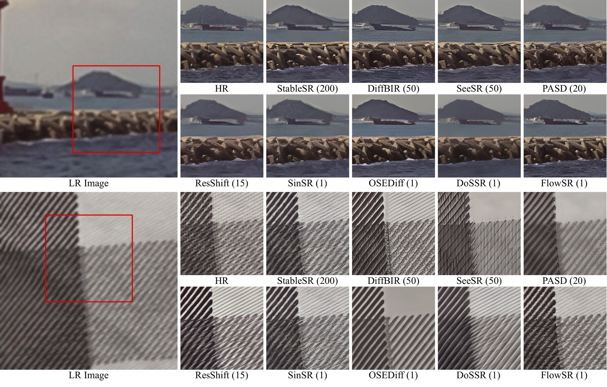
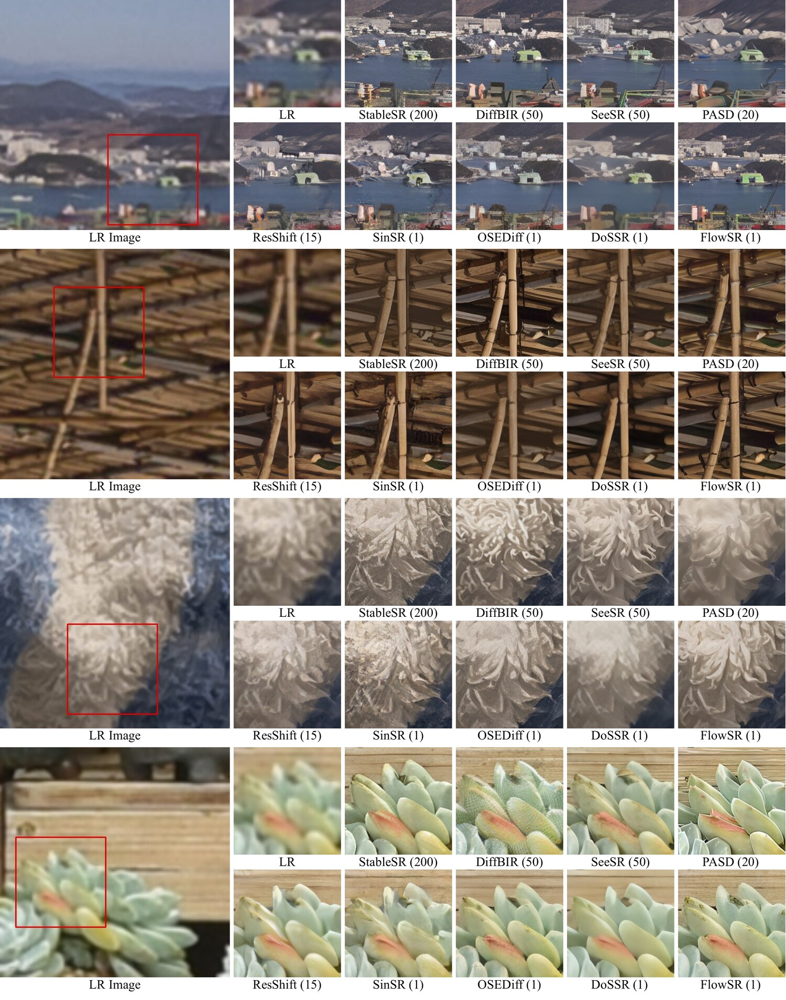
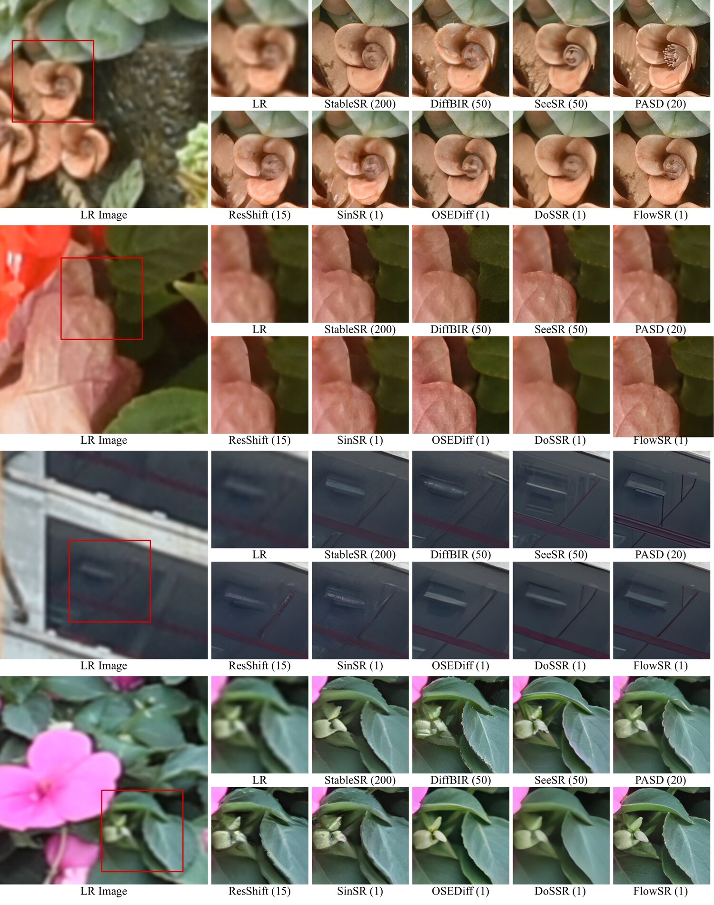
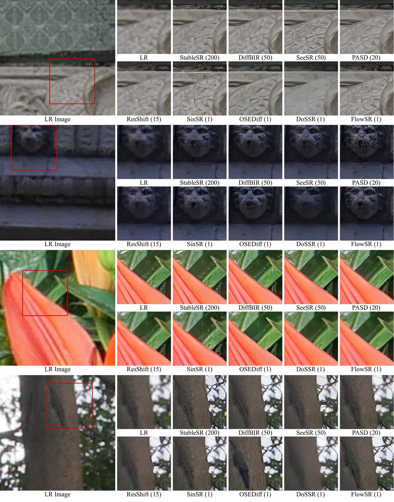

<h1 align="center">FlowSR</h1>
<p align="center"><b>Fast Image Super-Resolution via Consistency Rectified Flow</b></p>
<p align="center"><sub>ICCV 2025</sub></p>

<p align="center">
  <a href="https://openaccess.thecvf.com/content/ICCV2025/html/Xu_Fast_Image_Super-Resolution_via_Consistency_Rectified_Flow_ICCV_2025_paper.html">Paper</a> &nbsp;·&nbsp;
  <a href="https://arxiv.org/abs/2605.12377">arXiv</a> &nbsp;·&nbsp;
  <a href="https://openaccess.thecvf.com/content/ICCV2025/supplemental/Xu_Fast_Image_Super-Resolution_ICCV_2025_supplemental.pdf">Supplementary</a> &nbsp;·&nbsp;
  <a href="https://huggingface.co/chunjie-spring/FlowSR">Model</a> &nbsp;·&nbsp;
  <a href="#citation">BibTeX</a>
</p>

<p align="center">
  
  
  
  
</p>

<p align="center">
  Jiaqi Xu<sup>1,2</sup>, Wenbo Li<sup>2</sup>, Haoze Sun<sup>2</sup>, Fan Li<sup>2</sup>, Zhixin Wang<sup>2</sup>, Long Peng<sup>2</sup>,<br>
  Jingjing Ren<sup>3</sup>, Haoran Yang<sup>1</sup>, Xiaowei Hu<sup>4</sup>, Renjing Pei<sup>2</sup>, Pheng-Ann Heng<sup>1</sup>
</p>
<p align="center"><sub>
  <sup>1</sup>CUHK &nbsp;&nbsp; <sup>2</sup>Huawei Noah's Ark Lab &nbsp;&nbsp; <sup>3</sup>HKUST (GZ) &nbsp;&nbsp; <sup>4</sup>SCUT
</sub></p>

<p align="center">
  
</p>

> Welcome to the **FlowSR** project page, where we share the paper, method, and results. Since an official code release is not possible under the company's open-source policy, we point instead to a community-maintained, inference-only reproduction below.
>
> &nbsp;&nbsp;▸ &nbsp;**Unofficial inference code:** [github.com/springXIACJ/FlowSR](https://github.com/springXIACJ/FlowSR)
> &nbsp;&nbsp;▸ &nbsp;**Pretrained weights:** [huggingface.co/chunjie-spring/FlowSR](https://huggingface.co/chunjie-spring/FlowSR)

<br>

## At a glance

FlowSR restores a high-resolution image from a degraded low-resolution input in **a single network evaluation** — roughly **0.14 s** for a 4× upscale — while staying competitive with or ahead of multi-step diffusion methods.

- **Flow, not noise.** SR is cast as a *rectified flow* that travels straight from the LR image to the HR image, so sampling starts from the LR content instead of corrupting it with noise.
- **Consistency that respects the ground truth.** An *HR-regularized* consistency objective keeps the distilled one-step prediction anchored to the real HR target, not just to a (possibly drifting) teacher.
- **A scheduler that has it both ways.** A *fast–slow* time schedule pairs coarse, efficiency-oriented jumps with fine-grained steps that preserve texture.
- **Lean.** 982 M parameters — the smallest among one-step Stable-Diffusion-based SR models in our comparison.

<br>

## How it works

FlowSR uses a Stable Diffusion 2.1 backbone and trains in two stages: SR-flow pre-training, then consistency SR-flow distillation.

<p align="center">
  
</p>

**Rectified SR flow.**
We interpolate linearly between HR and LR, `X_t = (1 − t)·X_HR + t·X_LR`, and train a velocity field `v_θ` to follow the straight direction `X_LR − X_HR`. Inference reverses the ODE from the LR image with an Euler solver, supporting anywhere from many steps down to one:

```
X̂_HR  =  X_LR  −  v_θ(X_LR, 1)
```

Because the path begins at the LR image rather than at noise, structural information is preserved and sampling is stable and fast.

**HR-regularized consistency learning.**
Plain consistency distillation enforces agreement between neighbouring timesteps, but teacher approximation error can drift the distillation target away from the true HR image. FlowSR adds a term that pulls the student's prediction directly toward the ground-truth HR under mild perturbations.

<p align="center">
  
</p>

**Fast–slow time scheduling.**
Rather than sampling timestep pairs from the boundaries of one discretized interval, FlowSR draws adjacent timesteps from two schedulers — a *fast* one (few steps, e.g. 4) for large efficient jumps and a *slow* one (e.g. 1000) for fine-grained alignment. The combination broadens trajectory coverage and improves robustness to distribution shift.

**Training objective.**
Stage 1 minimizes an image-space flow loss (ℓ₂ + LPIPS). Stage 2 adds the HR-regularized consistency loss, a GAN loss for texture, and a CLIP-based image-quality alignment loss.

<br>

## Benchmarks

**Real-world test sets (RealSR & DRealSR).** Single-step FlowSR vs. state-of-the-art diffusion SR. **Bold** = best, <ins>underline</ins> = second best.

<div align="center">

| Dataset | Method | Steps | PSNR↑ | SSIM↑ | LPIPS↓ | DISTS↓ | FID↓ | NIQE↓ | MUSIQ↑ | MANIQA↑ | CLIPIQA↑ |
| :-- | :-- | :-: | :-: | :-: | :-: | :-: | :-: | :-: | :-: | :-: | :-: |
| **RealSR** | StableSR | 200 | 24.70 | 0.7085 | 0.3018 | 0.2288 | 128.51 | 5.91 | 65.78 | 0.6221 | 0.6178 |
| | SeeSR | 50 | 25.18 | 0.7216 | 0.3009 | 0.2223 | 125.55 | <ins>5.41</ins> | **69.77** | 0.6442 | 0.6612 |
| | ResShift | 15 | **26.31** | <ins>0.7421</ins> | 0.3460 | 0.2498 | 141.71 | 7.26 | 58.43 | 0.5285 | 0.5444 |
| | SinSR | 1 | <ins>26.28</ins> | 0.7347 | 0.3188 | 0.2353 | 135.93 | 6.29 | 60.80 | 0.5385 | 0.6122 |
| | OSEDiff | 1 | 25.15 | 0.7341 | <ins>0.2921</ins> | <ins>0.2128</ins> | <ins>123.49</ins> | 5.65 | 69.09 | 0.6326 | <ins>0.6693</ins> |
| | **FlowSR** | **1** | 25.54 | **0.7434** | **0.2728** | **0.2013** | **112.60** | **5.28** | <ins>69.22</ins> | <ins>0.6486</ins> | **0.6701** |
| **DRealSR** | StableSR | 200 | 28.03 | 0.7536 | 0.3284 | 0.2269 | 148.98 | 6.52 | 58.51 | 0.5601 | 0.6356 |
| | SeeSR | 50 | 28.17 | 0.7691 | 0.3189 | 0.2315 | 147.39 | 6.40 | <ins>64.93</ins> | 0.6042 | 0.6804 |
| | ResShift | 15 | 28.46 | 0.7673 | 0.4006 | 0.2656 | 172.26 | 8.12 | 50.60 | 0.4586 | 0.5342 |
| | OSEDiff | 1 | 27.92 | 0.7835 | **0.2968** | <ins>0.2165</ins> | <ins>135.30</ins> | 6.49 | 64.65 | 0.5899 | <ins>0.6963</ins> |
| | DoSSR | 1 | **28.55** | **0.7991** | 0.3353 | 0.2801 | 166.19 | 12.25 | 56.72 | 0.4623 | 0.5739 |
| | **FlowSR** | **1** | <ins>28.50</ins> | <ins>0.7859</ins> | <ins>0.2975</ins> | **0.2115** | **130.30** | <ins>6.13</ins> | **65.46** | **0.6172** | **0.7074** |

</div>

<sub>Full comparison incl. DiffBIR / PASD is in the paper. PSNR/SSIM on the Y channel (YCbCr). Eval sets: <a href="https://huggingface.co/datasets/Iceclear/StableSR-TestSets">Iceclear/StableSR-TestSets</a>.</sub>

**Efficiency** — one forward pass, no iterative sampling (4× SR from a 128×128 LR input):

<div align="center">

| | StableSR | SeeSR | ResShift | SinSR | OSEDiff | DoSSR | **FlowSR** |
| :-- | :-: | :-: | :-: | :-: | :-: | :-: | :-: |
| Steps ↓ | 200 | 50 | 15 | 1 | 1 | 1 | **1** |
| Params (M) ↓ | 1409 | 2511 | 174 | 174 | 1765 | 1718 | **982** |
| MACs (G) ↓ | 95382 | 66444 | 4962 | 2119 | 2323 | 3232 | **2148** |
| Time (s) ↓ | 13.54 | 5.21 | 0.89 | 0.13 | 0.16 | 0.28 | **0.14** |

</div>

<details>
<summary><b>DIV2K-Val results</b> (click to expand)</summary>

<br>

| Method | Steps | PSNR↑ | SSIM↑ | LPIPS↓ | DISTS↓ | FID↓ | NIQE↓ | MUSIQ↑ | MANIQA↑ | CLIPIQA↑ |
| :-- | :-: | :-: | :-: | :-: | :-: | :-: | :-: | :-: | :-: | :-: |
| StableSR | 200 | 23.26 | 0.5726 | 0.3113 | 0.2048 | **24.44** | 4.76 | 65.92 | 0.6192 | 0.6771 |
| SeeSR | 50 | 23.68 | 0.6043 | 0.3194 | <ins>0.1968</ins> | 25.90 | 4.81 | <ins>68.67</ins> | <ins>0.6240</ins> | **0.6936** |
| PASD | 20 | 23.14 | 0.5505 | 0.3571 | 0.2207 | 29.20 | **4.36** | **68.95** | **0.6483** | 0.6788 |
| ResShift | 15 | **24.65** | 0.6181 | 0.3349 | 0.2213 | 36.11 | 6.82 | 61.09 | 0.5454 | 0.6071 |
| OSEDiff | 1 | 23.72 | 0.6108 | <ins>0.2941</ins> | 0.1976 | 26.32 | 4.71 | 67.97 | 0.6148 | 0.6683 |
| DoSSR | 1 | 24.35 | **0.6265** | 0.3725 | 0.2786 | 50.27 | 10.38 | 58.44 | 0.5024 | 0.6187 |
| **FlowSR** | **1** | <ins>24.42</ins> | <ins>0.6192</ins> | **0.2798** | **0.1847** | <ins>24.52</ins> | <ins>4.63</ins> | 68.22 | 0.6193 | <ins>0.6901</ins> |

</details>

<br>

## Qualitative results

<p align="center">
  
</p>
<p align="center"><sub>Real-world examples; sampling steps in parentheses. Multi-step methods over-synthesize textures, other one-step methods blur — FlowSR keeps faithful structure and detail.</sub></p>

<details>
<summary><b>More comparisons</b> (click to expand)</summary>

<br>
<p align="center"></p>
<p align="center"></p>
<p align="center"></p>

</details>

<br>

## Resources

| Resource | Link |
| :-- | :-- |
| Paper (ICCV 2025) | [openaccess.thecvf.com](https://openaccess.thecvf.com/content/ICCV2025/html/Xu_Fast_Image_Super-Resolution_via_Consistency_Rectified_Flow_ICCV_2025_paper.html) |
| arXiv preprint | [arxiv.org/abs/2605.12377](https://arxiv.org/abs/2605.12377) |
| Supplementary PDF | [openaccess.thecvf.com](https://openaccess.thecvf.com/content/ICCV2025/supplemental/Xu_Fast_Image_Super-Resolution_ICCV_2025_supplemental.pdf) |
| Pretrained weights | [huggingface.co/chunjie-spring/FlowSR](https://huggingface.co/chunjie-spring/FlowSR) |
| Unofficial inference code | [github.com/springXIACJ/FlowSR](https://github.com/springXIACJ/FlowSR) |

<br>

<a name="citation"></a>
## Citation

```bibtex
@inproceedings{xu2025fast,
  title     = {Fast Image Super-Resolution via Consistency Rectified Flow},
  author    = {Xu, Jiaqi and Li, Wenbo and Sun, Haoze and Li, Fan and Wang, Zhixin and
               Peng, Long and Ren, Jingjing and Yang, Haoran and Hu, Xiaowei and
               Pei, Renjing and Heng, Pheng-Ann},
  booktitle = {Proceedings of the IEEE/CVF International Conference on Computer Vision},
  pages     = {11755--11765},
  year      = {2025}
}
```

<br>

## Acknowledgments & License

FlowSR builds on [OSEDiff](https://github.com/cswry/OSEDiff), [SeeSR](https://github.com/cswry/SeeSR), [S3Diff](https://github.com/ArcticHare105/S3Diff), and [PCM](https://github.com/G-U-N/Phased-Consistency-Model), alongside the Stable Diffusion, rectified flow, and consistency model literature cited in the paper.

The project is shared under [**CC BY-NC 4.0**](LICENSE) for non-commercial academic communication.
